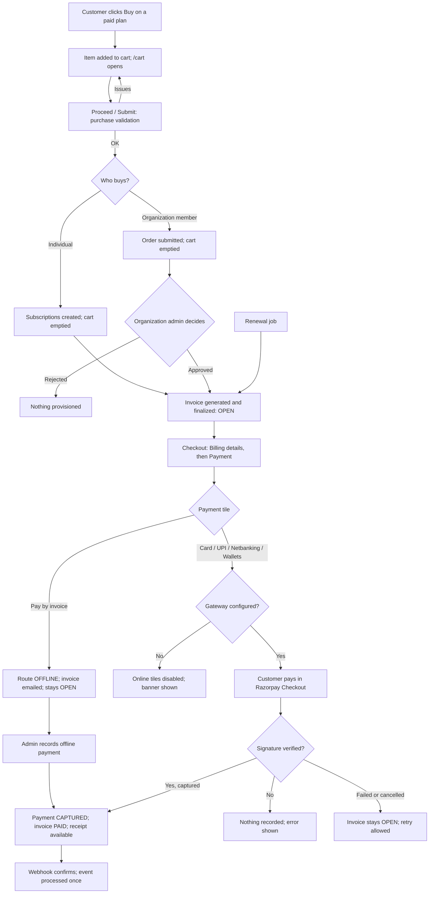

# Workflow — Purchase to payment

Spans Marketplace (03), Subscription (07), Billing & Payments (08) and Order & Provisioning (09). Feature-level states are in [cart-checkout/workflow.md](../02-requirements/FRD/cart-checkout/workflow.md) and [billing-payments/workflow.md](../02-requirements/FRD/billing-payments/workflow.md). Requirements: [REQ-MKT-003](../02-requirements/FRD/cart-checkout/requirement.md) (cart, [C59](../01-business/roadmap/open-decisions.md#c59), Draft) and [REQ-BIL-001](../02-requirements/FRD/billing-payments/requirement.md).

## Open points
- **Activation and payment — Not specified** (REQ-BIL-001 Open question 3). Today a subscription becomes active on subscribe or on order approval, before any payment. The diagram shows today's order; activation is not drawn as depending on payment.
- **Several products in one cart** (REQ-MKT-003 Open question 1): whether one invoice covers several subscriptions, and how an organization cart becomes orders, is not decided. The diagram does not fix either.
- **Provisioning** ([C56](../01-business/roadmap/open-decisions.md#c56), [REQ-ORD-002](../02-requirements/FRD/provisioning-contract/requirement.md), Draft): once built, subscription start (and suspension, resumption, cancellation) also notifies the hosted product, which reports the tenant back as a service instance ([C57](../01-business/roadmap/open-decisions.md#c57)). Not drawn until the contract is approved.
