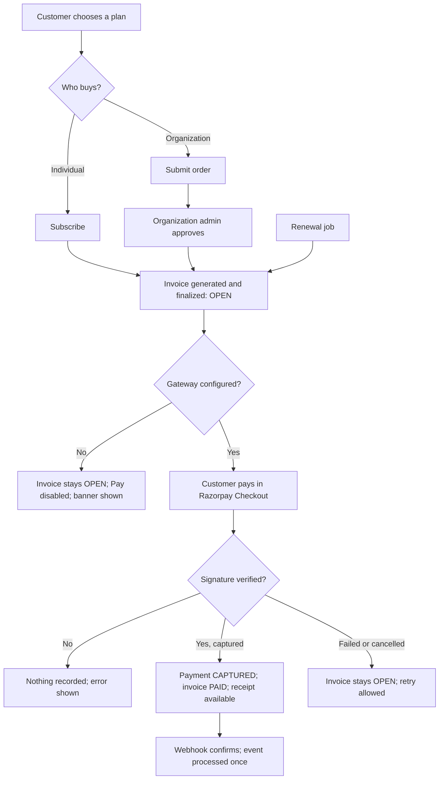

# Workflow — Purchase to payment

Spans Marketplace (03), Subscription (07), Billing & Payments (08) and Order & Provisioning (09). Feature-level states are in [billing-payments/workflow.md](../02-requirements/FRD/billing-payments/workflow.md). Requirement: [REQ-BIL-001](../02-requirements/FRD/billing-payments/requirement.md).

## Open point: activation and payment
**Not specified** (FRD Open question 3). Today a subscription becomes active on subscribe or on order approval, before any payment. The product owner must decide whether activation should wait for the first payment. The diagram shows today's order; activation is not drawn as depending on payment.
