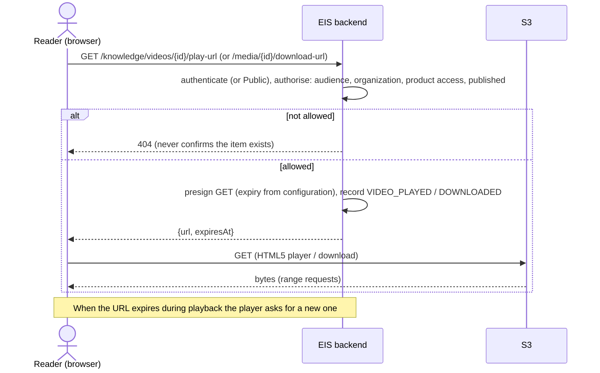

# Workflow — Secure video playback and file download

**Status:** Built 2026-10-05 ([C78](../01-business/roadmap/open-decisions.md#c78)); defined 2026-10-05). [REQ-KNW-004.6](../02-requirements/FRD/knowledge-videos/requirement.md), [REQ-KNW-003.8](../02-requirements/FRD/knowledge-media/requirement.md), [BR-KVS-001](../03-business-rules/BR-KVS-001-knowledge-visibility.md).

YouTube: the page embeds the YouTube player after the same audience check; External: the configured player or link.
